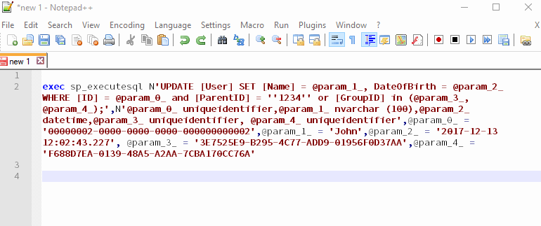

# SpExecuteSqlTransformer #

A small tool to automatically transform SQL expression starting with `exec sp_executesql` to make working with such queries easier.

## What is it doing? ##

It transforms expressions like

```sql
exec sp_executesql N'UPDATE [User] SET [Name] = @param_1_, DateOfBirth = @param_2_ WHERE [ID] = @param_0_ and
 [ParentID] = ''1234'' or [GroupID] in (@param_3_, @param_4_);',N'@param_0_ uniqueidentifier,@param_1_ nvarchar
 (100),@param_2_ datetime,@param_3_ uniqueidentifier, @param_4_ uniqueidentifier',@param_0_ =
 '00000002-0000-0000-0000-000000000002',@param_1_ = 'John',@param_2_ = '2017-12-13 12:02:43.227',
 @param_3_ = '3E7525E9-B295-4C77-ADD9-01956F0D37AA',@param_4_ = 'F688D7EA-0139-48A5-A2AA-7CBA170CC76A'
```

to something like

```sql
UPDATE [User]
SET [Name] = 'John'
    ,DateOfBirth = '2017-12-13 12:02:43.227'
WHERE [ID] = '00000002-0000-0000-0000-000000000002'
    AND [ParentID] = '1234'
    OR [GroupID] IN (
        '3E7525E9-B295-4C77-ADD9-01956F0D37AA'
        ,'F688D7EA-0139-48A5-A2AA-7CBA170CC76A'
        );
```

This means it

* replaces the parameters,
* unwraps/unescapes the query string,
* removes the `exec sp_executesql` prefix,
* and formats the whole expression => Formatting uses the [Poor Man's T-SQL Formatter](https://github.com/TaoK/PoorMansTSqlFormatter).

## Why is this useful? ##

My personal use case: Some time ago, I was working with and debugging applications which executed a lot of SQL queries like the sample above (just longer and with more parameters). From time to time I captured the queries in the profiler and had to inspect them in detail.

I wanted to be able to play around with the query, execute just a part of the query without specific conditions, change parameter values directly where they were used, etc.

As this is not possible with the original query, I usually copied the query in another window/application and started to manually unescape (and sometimes format) the string and to replace the parameters.

I was looking for a way to automate this task, and as I couldn't find anything suitable, I built this tool. It now is available on GitHub as it may be useful for others too.

## Setup ##

* Clone the repository and build the solution

## Usage ##

* Just call `SpExecuteSqlTransformer.Runner.exe`
* It automatically reads the contents of the clipboard and tries to apply the described actions
* After that, it writes the result back to the clipboard
* One way to make the tool easier to execute and incorporate it to one's workflow, is to use a global hotkey, for example with the help of [AutoHotKey](https://www.autohotkey.com/).
* The repository already contains two AutoHotKey-[scripts](Scripts):
  * [SpExecuteSqlTransformer_Format.ahk](Scripts/SpExecuteSqlTransformer_Format.ahk): This registers the global hotkey `AltGr+F`. Pressing the shortcut executes `SpExecuteSqlTransformer.Runner.exe`. After that the transformed string can be inserted anywhere by pressing `Ctrl+V`.
  * [SpExecuteSqlTransformer_CopyAndFormat.ahk](Scripts/SpExecuteSqlTransformer_CopyAndFormat.ahk): This registers the global hotkey `AltGr+F`. Pressing the shortcut sends a `Ctrl+C` and subsequently executes `SpExecuteSqlTransformer.Runner.exe`. After that the transformed string can be inserted anywhere by pressing `Ctrl+V`:


* Other alternatives to simplify the usage are for example launchers like [Wox](http://www.wox.one/) or [Hain](https://github.com/hainproject/hain).

### Details ###

* In case the string unwrapping or replacement of the parameters fails, the tool falls back to formatting only. Therefore it acts as a global formatter, too.
* Parameter replacement, string unescaping, removal of the `exec sp_executesql` prefix currently only works if the given string starts with `exec sp_executesql`. The only exception are leading whitespaces. In case the expression starts with any other characters, the tool will fail and fall back to formatting only.
* If the formatting fails the transformed string starts with `-- [SQL_FORMATTING_ERROR]`
* Per default, details are found in the directory where the application lives in `logs/log.txt`

## Aren't there easier ways to implement this? ##

Yes, of course there are!

Certainly this could be implemented without re-inventing and implementing part of a pseudo SQL-parser (and re-using existing libraries or code instead), but at the time I wrote this tool, I also wanted to play around with lexer/parser logic and learn something ;)

## Platforms ##

SpExecuteSqlTransformer currently runs on Windows only.

## Dependencies ##

This project uses the following 3rd party libraries:

* [log4net](http://logging.apache.org/log4net/)
* [Ninject](http://www.ninject.org/)
* [NUnit](http://nunit.org/)
* [Poor Man's T-SQL Formatter](https://github.com/TaoK/PoorMansTSqlFormatter)
